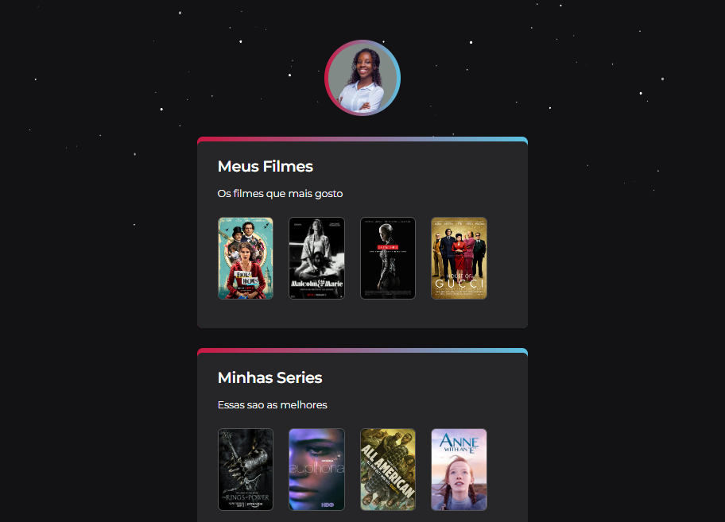

# NLW Desafio  Extra

## Trilha Explorer

---

Projecto construido apos o evento NextLevelWeek, Desafio proposto pelo formador [Mayk Brito](https://github.com/maykbrito/maykbrito) para consolidacao dos topicos abordados.

## O que esta faltando?
    -Terminar card 3
    -Animacoes
    -Transicoes

🔗
[Link de acesso para a pagina](https://gnyvasco.github.io/nlw-desafio-extra/)

## 🛠Tecnologias

    -HTML
    -CSS
    -Git e Github

---
## 📲Contacto

genny.p.vasco@gmail.com

[Linkedln: Genny Vasco](https://www.linkedin.com/in/genny-vasco-0ab19721b/)